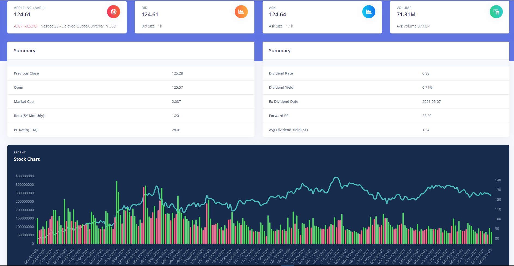
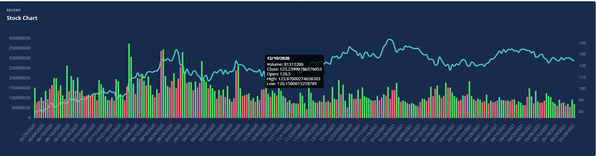
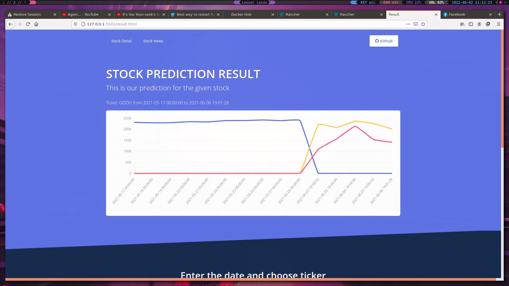
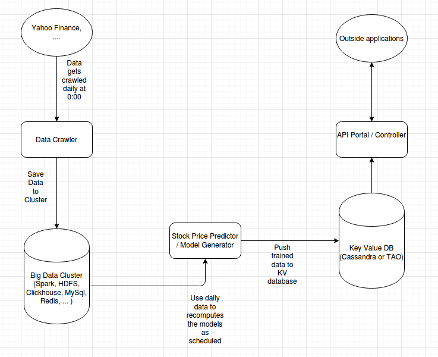

# Stock trending using Machine Learning

## MỤC LỤC : 

### [Stock trending using Machine Learning](#stock-trending-using-machine-learning)

#### [I. MỤC LỤC](#mục-lục-)

#### [II. Chi tiết đề tài](#chi-tiết-đề-tài-)

#### [III. Tài liệu tham khảo](#tài-liệu-tham-khảo-)

#### [IV. Benchmark hệ thống](#benchmark-hệ-thống-)

## Chi tiết đề tài : 

_ **Sinh viên thực hiện** : 

- [Nguyễn Thanh Tùng](https://github.com/pinezapple)
- [Phạm Thanh Hằng](https://github.com/phamthanhhang208)
- [Bàn Phúc Mạnh](https://github.com/banmanh482)

_ [**Các tài liệu khác**](https://drive.google.com/drive/u/0/folders/1HEeWtAvx3QEX8-NdKroqLt776YLoR2bw)

## Tổng quan hệ thống:

### Thông tin về stock:
-Dữ liệu được cập nhật mới nhất từ Yahoo Finance (sử dụng [**Yahoo Finance API**](https://rapidapi.com/finance.yahoo.api/api/yahoo-finance-low-latency))

-Hiển thị thông tin biến động giá cổ phiếu từ 1 năm trước đến nay 

-Tin tức liên quan đến cổ phiếu được cập nhật mới nhất [**NewsAPI**](https://newsapi.org/docs/get-started)

-Dữ liệu dự đoán giá cổ phiếu

### Prediction - SystemX

- Hệ thống bao gồm 3 components chính là:
    + Data Crawler (getStockData)()
    [Docker image](https://hub.docker.com/repository/docker/pinezapple/stock-project-crawler) 

    + Price Generator
    [Docker image](https://hub.docker.com/repository/docker/pinezapple/lsmt-stock-model)

    + Poral API 
    [Docker image](https://hub.docker.com/repository/docker/pinezapple/stock-portal) 

- Dưới đây là hình ảnh tổng quan về sơ đồ  các components hệ thống tương tác:

### Chi tiết về các thành phần :

#### [1. Data Crawler & Portal](https://github.com/pinezapple/20202-Stock-Project/tree/main/systemX)

#### [2. Price Predictor](https://github.com/pinezapple/20202-Stock-Project/tree/main/systemX/Price_Generator)

### Benchmark hệ thống : 

#### 2.1. Crawler performance:
+ Để ghi 3000 dòng record vào 1 shard, Crawler tốn khoảng thời gian giao động từ 11.6 - 13.4 giây (DBMS là mysql).

#### 2.2. Training Data Performance: 

+ Cấu hình máy : Dell M4800 - Intel I7 - 4910MQ

+ Đối với [mô hình LSTM 2 lớp](https://github.com/pinezapple/20202-Stock-Project/tree/main/systemX/Price_Generator#2-m%C3%B4-h%C3%ACnh-lstm-2-l%E1%BB%9Bp-)
    - Thời gian trung bình hết khoảng 1 phút 20 giây cho 1 ticker.
    - Settings :
      - Thời gian lấy dữ liệu : 01/01/2010 - 01/01/2020
      - BATCH_SIZE = 365
      - EPOCHS = 10
      - UNITS = 365
      - CELL = LSTM
      - N_LAYERS = 2
      - DROPOUT = 0.3

## Tài liệu tham khảo : 

_ [Machine Learning cơ bản](https://drive.google.com/open?id=0B7ujsutwirjXLXlwcnZUTjVVRXVjd19WNlVmREdac0xFNGIw)

_ [A Novel Algorithmic Trading Framework](https://drive.google.com/open?id=0B7ujsutwirjXc2YzVWdYWUZUZnBzNEp1MXotNVhrUEpfTmlj)

_ [Machine Learning Algorithm To Predict Stock Direction](https://medium.com/@jasonbamford/machine-learning-algorithm-to-predict-stock-direction-d54b7666cc7c)
