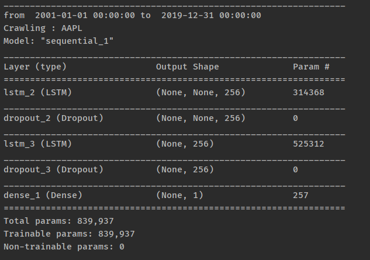
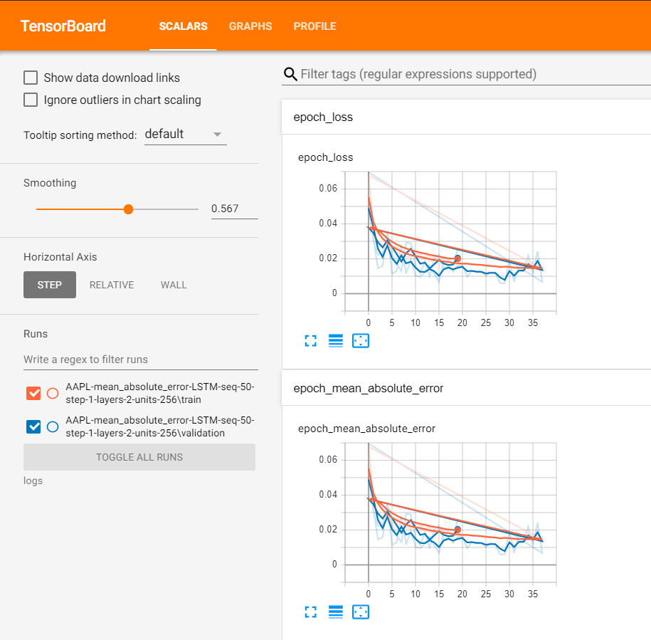
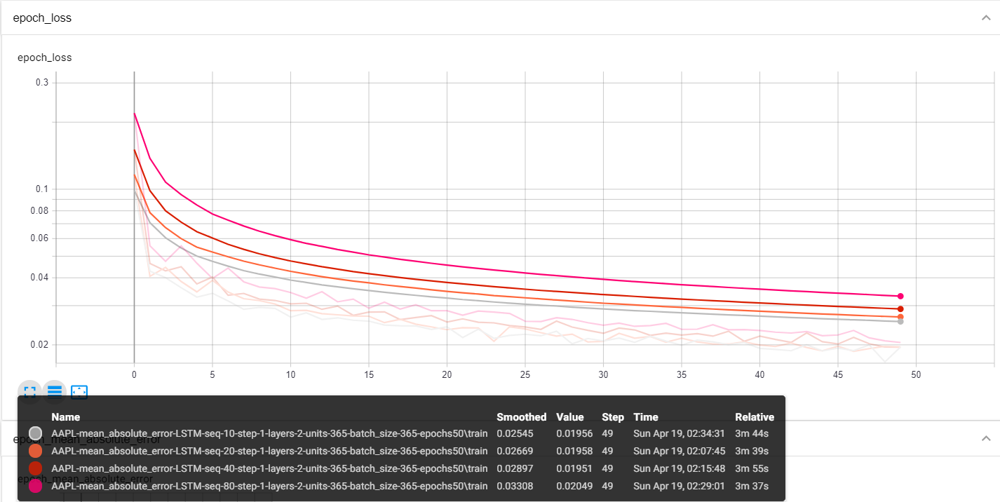
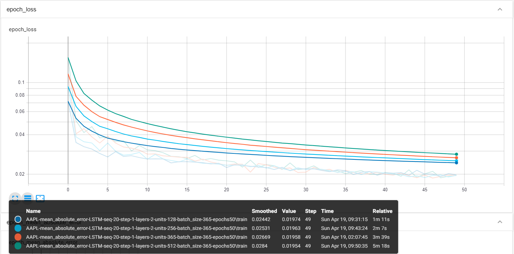

# Xây dựng neural network đơn giản dự đoán xu hướng chứng khoán bằng tensorflow

## I. Chi tiết :

_ Python : 3.7.7

_ Tensorflow : 2.1.0 

## II. Chi tiết chương trình :

### 1. Lấy dữ liệu :

_ DataFrame của dữ liệu chứng khoán được tạo tại file : **ticker_data.py**

_ Dữ liệu được lấy theo các tham số và trả về kết quả trong 1 từ điển

_ Các tham số nhận vào :

- Dữ liệu : APPL (Apple)

- Thời gian :
    - Bắt đầu : 1/1/2001
    - Kết thúc : 31/12/2019

- lookup_steps = 1 (Khoảng tương lai để dự đoán)

- n_steps = 50 (Độ dài dữ liệu đầu vào cho model)

- test_size = 0.1 (Tỉ lệ tập test và tập huấn luyện)

_ Kết quả trả về :

- df : dataframe crawl về từ yahoo API

- column_scaler : scale lại data bằng MinMaxScaler

- last_sequence : sử dụng để dự đoán trong những ngày trong tương lai không có sẵn trong tập dữ liệu

- Dữ liệu để huấn luyện model 
    
    - X_train
    
    - X_test
    
    - y_train
    
    - y_test
    
### 2.Tạo model

_ Được tạo tại file **model.py**

_ Tham số nhận vào :

- input_length : độ dài dữ liệu nhận vào

- units : không gian đầu ra của layer

- cell : LSTM (Long short-term memory)

- n_layers : số lớp LSTM sẽ tạo ra

- dropout : tỉ lệ bỏ qua units

- loss : hàm mất mát

- [optimizer](https://keras.io/optimizers/) : RMSprop

_ Layer Dense : trả về 1 giá trị là giá cổ phiếu dự đoán theo *lookup_steps*



### 3. Huấn luyện model

```python
model_name = f"{TICKER}-{LOSS}-{CELL.__name__}-seq-{N_STEPS}-step-{LOOKUP_STEPS}-layers-{N_LAYERS}-units-{UNITS}"

checkpointer = ModelCheckpoint(os.path.join("results", model_name), save_best_only=True, verbose=1)
tensorboard = TensorBoard(log_dir=os.path.join("logs", model_name))

history = model.fit(data['X_train'], data['y_train'],
                    batch_size=BATCH_SIZE, epochs=EPOCHS,
                    validation_data=(data['X_test'], data['y_test']),
                    callbacks=[checkpointer, tensorboard],
                    verbose=1)
```

_ batch_size : số lượng mẫu dữ liệu trong 1 batch

_ epochs : số lần lặp huấn luyện trong một batch

_ checkpointer : dùng để lưu lại model sau mỗi epochs (chỉ lưu lại model tốt nhất)

_ tensorboard : công cụ đồ họa được cung cấp với TensorFlow
    
- Dùng lệnh dưới bằng command line
```bash
tensorboard --logdir="logs"
```

- Truy cập localhost:6006 để xem kết quả huấn luyện model 




### 4. Kiểm tra model : 

_ Load lại model :

```python
model_path = os.path.join("results", model_name) + ".h5"
model.load_weights(model_path)
```

_ Đánh giá model bằng tập test :
```python
mse, mae = model.evaluate(data["X_test"], data["y_test"])
```

_ Tính toán "mean absolute error" (Giá trị dự đoán so với giá trị thực):
```python
mean_absolute_error = data["column_scaler"]["Adj Close"].inverse_transform(mae.reshape(1, -1))[0][0]
print("Mean Absolute Error:", mean_absolute_error)
```

### 5. Dự đoán giá chứng khoán :


## III. Model dự đoán :

###  1. Thay đổi N_STEPS :

_ Các tham số không đổi :
```
LOOKUP_STEPS = 1
TEST_SIZE = 0.1
BATCH_SIZE = 365
EPOCHS = 50
UNITS = 365
CELL = LSTM
N_LAYERS = 2
DROPOUT = 0.3
```
#### 1.1. N_STEPS = 10 :

Mean Absolute Error: 5.699003

#### 1.2. N_STEPS = 20 :

Mean Absolute Error: 4.5525084

#### 1.3. N_STEPS = 40 :

Mean Absolute Error: 4.9959974

#### 1.4. N_STEPS = 80 :

Mean Absolute Error: 8.168781 

#### Epoch loss :



### 2. Thay đổi UNITS

_ Các tham số không đổi :
```
LOOKUP_STEPS = 1
TEST_SIZE = 0.1
BATCH_SIZE = 365
EPOCHS = 50
N_STEPS = 20
CELL = LSTM
N_LAYERS = 2
DROPOUT = 0.3
```

#### 2.1. UNITS = 128 :

Mean Absolute Error: 6.968446 

#### 2.2. UNITS = 256 :

Mean Absolute Error: 5.3770585

#### 2.3. UNITS = 512 :

Mean Absolute Error: 7.841156 

#### 2.4. UNITS = 365 : 

Mean Absolute Error: 4.7897167

#### Epoch loss :

